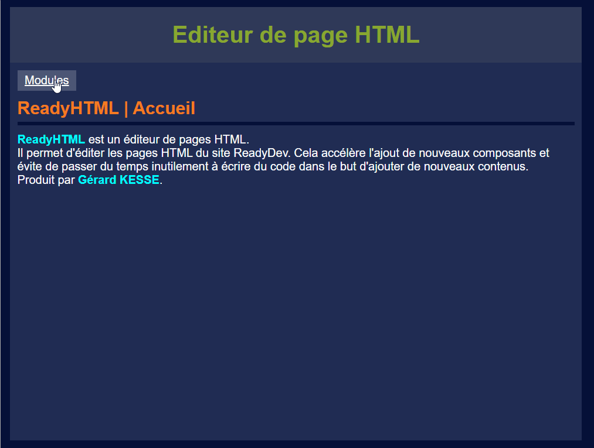

# Introduction

Bienvenue dans ce tutoriel consacré à la conception d'un système de gestion de contenu web (CMS) 
en PHP sous le système Windows avec l'utilisation de l'outil WampServer (Windows Apache MySQL PHP).

Un CMS (Content Management System) est un système de gestion de contenu. 
Il aide les entreprises à gérer leur contenu numérique. Il permet de créer, 
de gérer et de modifier facilement un site web, sans avoir besoin de connaissances 
techniques en langage informatique. Des équipes entières peuvent utiliser ce système 
pour créer, modifier, organiser et publier du contenu. Dans un CMS, le fond et la forme 
sont dissociés, ce qui simplifie la création de site web. Il vous suffit par exemple 
de copier le texte dans le champ prévu à cet effet et de cliquer sur le bouton "Publier" 
pour mettre ce contenu en ligne. C'est bien sûr la même chose pour des photos ou des vidéos.

# Demo de l'application

# Contacts

- [Tutoriel](https://readydev.ovh/home/tutoriels/php/application/systeme-gestion-contenu-web "Consultez le tutoriel sur (ReadyDev)")
- [LinkedIn](https://www.linkedin.com/in/tia-gerard-kesse/ "Contactez-moi sur (LinkedIn)")
